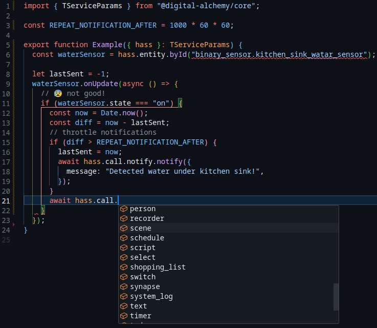

## Description
Welcome to `@digital-alchemy/hass`!

This repository contains generic extensions for interacting with Home Assistant, including websocket & rest api adapters, entity & event management, backup workflows, and more.
## Features
### First class editor experiences

- Did you just typo that entity name?
- Just what services are actually available?

Create references to entities that will always reflect their current state. Get details about all the services your setup supports and how to use them, directly in your editor.



### Managed Websocket

Don't worry about all the complexities of dealing with home assistant. Let the library help by handling all the connection logic, keeping track of events for you, formatting requests, and

## Configuration
### Custom Types

This library has support for customizing type definitions to match a particular Home Assistant install. This functionality requires the [type-writer](https://github.com/Digital-Alchemy-TS/type-writer) command to be installed as well.

> Add to `devDependencies`!
```bash
npm i --save-dev @digital-alchemy/type-writer
npx type-writer
```
Custom types only affect the development experience, and have no impact on the way the application runs.

### Supervised Support

If your code is running within a Home Assistant addon environment, it will automatically connect with no additional configuration needed.

### Manual

For code running elsewhere, manual configuration is required. You will need a **Long Lived Access Token**, which can be generated on your user profile. You can store your config at `./.{app_name}` or `~/.config/{app_name}` in **INI** format.

> Don't forget to configure "`type_writer`" also!

```ini
[hass]
  BASE_URL=http://localhost:8123
  TOKEN=YOUR LONG LIVED ACCESS TOKEN
```
## Related Projects

For additional projects that build on and consume this library, check out these other projects


| GitHub                                                              | Description                                                                             | NPM                                                                                      |
| ------------------------------------------------------------------- | --------------------------------------------------------------------------------------- | ---------------------------------------------------------------------------------------- |
| [synapse](https://github.com/Digital-Alchemy-TS/synapse)            | Tools for generating entities within home assistant.                                    | [@digitial-alchemy/synapse](https://www.npmjs.com/package/@digital-alchemy/synapse)      |
| [automation](https://github.com/Digital-Alchemy-TS/automation)      | Advanced automation tools for creating dynamic workflows.                               | [@digital-alchemy/automation](https://www.npmjs.com/package/@digital-alchemy/automation) |
| [type-writer](https://github.com/Digital-Alchemy-TS/terminal)       | Generate custom type definitions for your setup.                                        | [@digital-alchemy/type-writer](https://www.npmjs.com/package/@digital-alchemy/terminal)  |
| [automation-template](https://github.com/Digital-Alchemy-TS/gotify) | Start your own Home Automation project with the `@digital-alchemy` quick start template |                                                                                          |
